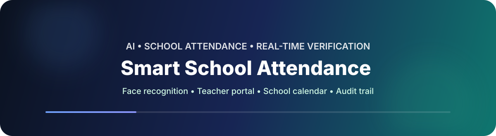
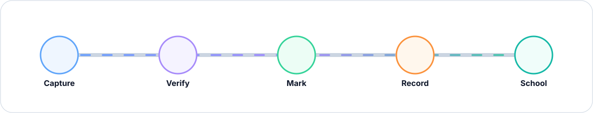

<div align="center">

<a href="https://github.com/ApexPredetor-67/school-attendence_">
  
</a>

### 🏫 AI-powered attendance built around a real school workflow

**Face recognition · Teacher portal · Admin controls · School calendar · Reports · Audit logs**

<br/>

[](https://www.python.org/)
[](https://flask.palletsprojects.com/)
[](https://opencv.org/)
[](https://supabase.com/)
[](https://render.com/)

<br/>

> **One student at a time. Seven-frame conservative verification. Clear school-day rules.**

</div>

---

## ⚡ What this project does

This is a school-focused attendance system that replaces a manual roll call with a webcam-based verification flow while keeping the everyday experience simple for teachers and administrators.

It includes separate **Admin**, **Teacher**, and **Attendance Scanner** experiences, plus a configurable school calendar, attendance reports, teacher account management, student face registration, and audit logging.

<div align="center">
  
</div>

---

## 🔥 Highlights

| Area | What you get |
|---|---|
| 🤖 Face attendance | 7-frame conservative verification, face-quality checks, registered face encodings, duplicate protection |
| 👨‍💼 Admin | Students, teachers, attendance, school calendar, school-time testing, account controls |
| 👩‍🏫 Teachers | Assigned-class students, attendance view, calendar, password change, exports |
| 📅 Calendar | Working/non-working days, holidays, custom dates, school tentative-calendar import |
| 📊 Reports | Excel, PDF, print-friendly attendance views |
| 🔎 Audit | Admin audit log available directly at `/audit` |
| 🔐 Access | Separate admin/teacher authentication and account controls |
| ☁️ Deployment | Render + Supabase/PostgreSQL friendly |

---

## 🧠 Attendance logic

The scanner uses the school-day rules configured for the application:

| Time | Result |
|---|---|
| **07:30–08:29** | 🟢 Present |
| **08:30–08:59** | 🟡 Late |
| **09:00 onward** | 🔴 Absent |

The seven-frame verification flow is intentionally conservative: the scanner waits for multiple frames instead of accepting a single noisy camera frame.

> **Important:** the scanner flow should be tested with a real browser camera permission. Do not change the capture endpoint or frame format when customizing the frontend.

---

## 🖥️ Main areas

### Admin

- Dashboard and school-time testing controls
- Student registration + face capture
- Student management and attendance reports
- Teacher creation, enable/disable, and deletion
- School calendar administration
- Direct audit-log access via `/audit`

### Teacher

- Dashboard for the assigned class
- Student list ordered by roll number
- Attendance records
- School calendar
- Quick link for changing the teacher password

### Scanner

- Webcam capture
- One student at a time
- Seven-frame verification
- Attendance marking based on the school-day rules

---

## 🗓️ School calendar

The calendar is designed around actual school dates rather than generic work schedules.

Admins can maintain working and non-working dates and use a **PDF/image tentative school calendar** as the source for dates that should automatically be treated as school days or holidays.

That lets attendance logic answer the important question before marking a student:

> **“Is today actually a working school day?”**

---

## 📂 Project structure

```text
school-attendence_/
├── app.py
├── models.py
├── face_utils.py
├── exports.py
├── jobs.py
├── notifications.py
├── requirements.txt
├── render.yaml
│
├── static/
│   └── app.js
│
├── templates/
│   ├── admin*.html
│   ├── teacher*.html
│   ├── scan.html
│   ├── calendar.html
│   └── ...
│
└── assets/
    ├── attendance-banner.svg
    └── flow.svg
```

---

## 🚀 Run locally

### 1. Clone

```bash
git clone https://github.com/ApexPredetor-67/school-attendence_.git
cd school-attendence_
```

### 2. Create a virtual environment

```bash
python -m venv .venv
```

**Windows**

```bash
.venv\Scripts\activate
```

**macOS / Linux**

```bash
source .venv/bin/activate
```

### 3. Install dependencies

```bash
pip install -r requirements.txt
pip install --no-deps face-recognition==1.3.0
```

### 4. Configure environment variables

Create a `.env` file with the values required by your deployment, especially the database URL, secret key, admin credentials, and any notification credentials you actually use.

See:

- `RENDER_SETUP.md`
- `SUPABASE_RENDER_SETUP.md`

### 5. Start Flask

```bash
python app.py
```

Then open:

```text
http://127.0.0.1:5000
```

---

## ☁️ Render deployment

The repository already contains a `render.yaml` configuration for the web service.

```bash
gunicorn --workers 1 --threads 4 --timeout 180 --bind 0.0.0.0:$PORT app:app
```

The app is configured for:

- Python 3.12
- `Asia/Kolkata` application timezone
- Supabase/PostgreSQL
- `/tmp` for ephemeral Render storage

Before deploying, verify all secrets are configured in Render rather than committing them to Git.

---

## 🧪 Debugging notes

This project is deliberately defensive around browser/API failures.

A few useful checks when something looks wrong:

```text
Camera → Browser permission → Frame capture → /api/attendance/mark
Teacher form → JSON request → /api/admin/teachers
Calendar page → /api/calendar
School-time test → /api/admin/clock
Audit → /audit
```

When debugging a `400` from an API endpoint, inspect the browser Network tab first and confirm the request is actually sending JSON with the expected field names.

---

## 🛡️ Security basics

- Keep `.env` out of Git.
- Use a strong `SECRET_KEY` in production.
- Never commit real passwords, database URLs, or API tokens.
- Limit admin credentials to school staff who need them.
- Treat face data as sensitive information and follow your school's privacy requirements.

---

## 🧾 License / project note

This repository is intended as a school attendance project and can be adapted for classroom, club, coaching, or institution-level use.

Because the project uses face recognition, always validate accuracy, consent, retention, and local privacy requirements before using it in a real institution.

---

<div align="center">

### Made for the classroom, not the corporate boardroom. 🏫

⭐ **Star the repo** if you build on it · 🛠️ **Fork it** if you want to customize it · 🐛 **Report bugs** when you find them

</div>
